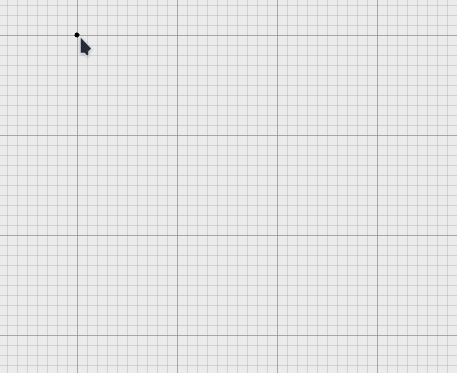
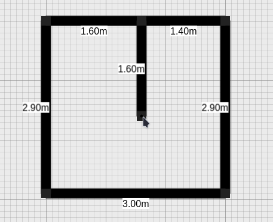
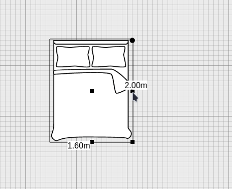
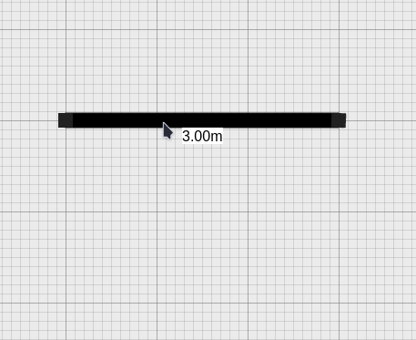
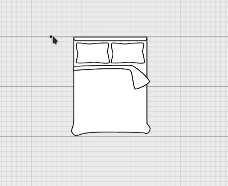

<p align="center">
  
</p>

## Introduction

Even had to redesign a room, a floor, or your entire house, and you spent hours drawing floor plans by hand, on graph paper, trying to make sure your sofa will fit next to the dresser? I certainly have, and it's a frustrating experience. I think we can do better than that.

As the vast majority of floor planner apps are available as part of a paid service, or too complicated to use for my needs, I decided to write my own. 
Enter Arcada, an open-source floor planner app.


[](https://arcada.nicoleta.cc)


 


[](https://app.netlify.com/projects/mellow-cobbler-3a9fb9/deploys)


## Features
### 👷‍♀️ Add walls

<p>
  
</p>

### ⚒️ Edit walls

<p>
  
</p>

### 🛋️ Add/edit furniture

<p>
  
</p>

### 🚪 Add doors/windows

<p>
  
</p>

### 📏 Measure tool

<p>
  
</p>

#### 🌟 Accurate to scale
#### 🌟 Multiple floor support
<p>
  
</p>

#### 🌟 Print your designs


#### 🌟 Save/load support

<p>
  
</p>

#### 🌟 Component library with plenty of options

<p>
  

</p>

#### 🌟 Cross-platform

## Tech stack and docs

Client built using React, Pixi.js, Zustand, with Mantine as the component library for the UI. The floor plan engine is custom built. 

Server-side powered by Express.js, using MongoDB with Mongoose as ODM. 

[](https://github.com/mehanix/arcada-backend)
[](https://github.com/mehanix/arcada/blob/4ab6e5d267bd901d2c8b962a782df3f422358d86/docs/Docs%20-%20Bachelor's%20thesis.pdf "Go to project documentation")

## Quick setup

If you want to run the app for yourself the easiest way to to is to use the following [docker-compose setup](https://github.com/perguth/arcada-setup). Have fun!

Alternatively:

Clone this repo and the `arcada-backend` repo. Run the following:
```
npm i 
npm run start
```

Launch the back-end using `node app.js`.
